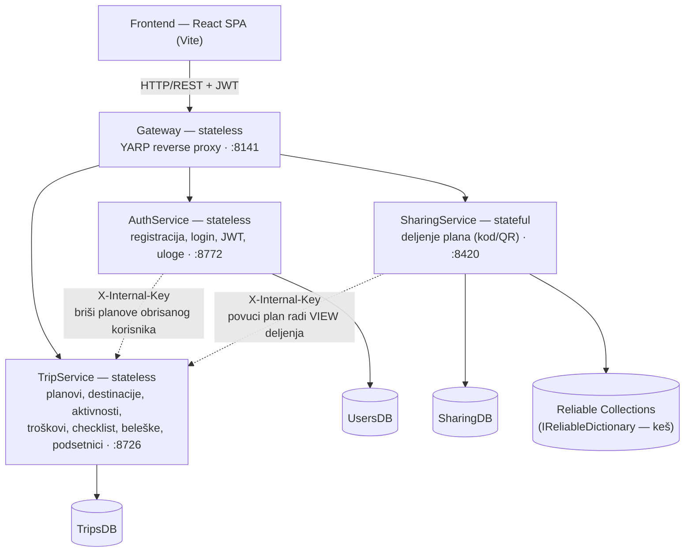
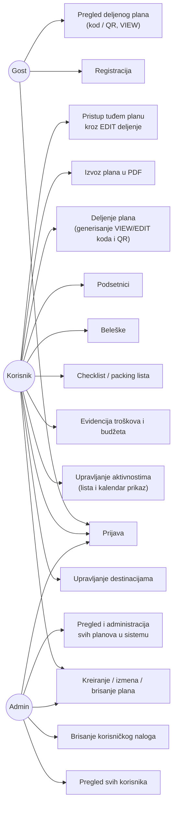

# Travel Planner

Projekat iz predmeta **Primena veb programiranja u infrastrukturnim sistemima** — web aplikacija za
planiranje putovanja: planovi, destinacije, dnevne aktivnosti (sa prikazom kroz kalendar), troškovi i
budžet, beleške, podsetnici, checklist/packing lista, korisničke uloge i deljenje plana putem koda ili
QR koda (VIEW / EDIT pristup).

Dijagrami se nalaze u [`dijagrami/`](dijagrami/): `arhitektura.svg` i `use-case.svg`. `arhitektura.svg`
je generisan iz istoimenog `.mmd` fajla (Mermaid dijagram renderovan u SVG preko `mermaid-cli`).
`use-case.svg` je ručno crtan u UML notaciji (akteri kao figure, use case-ovi kao elipse, granica
sistema, generalizacija Admin → Korisnik) radi standardnog UML izgleda.

## 1. Arhitektura sistema

Mikroservisna arhitektura na **Microsoft Service Fabric** (lokalni klaster), perzistencija u
**Microsoft SQL Server** — jedna baza po servisu (database-per-service), bez deljenja tabela.




- **Gateway** (stateless) — jedina ulazna tačka za frontend; YARP reverse proxy rutira zahteve ka
  ostalim servisima po putanji (vidi tabelu ruta ispod). Ne sadrži sopstvenu poslovnu logiku ni bazu.
- **AuthService** (stateless) — registracija, prijava, izdavanje i potpisivanje JWT tokena, uloge
  (Korisnik/Admin), administracija korisničkih naloga. Baza `UsersDB`.
- **TripService** (stateless) — centralni servis sa celokupnim sadržajem plana: destinacije,
  aktivnosti, troškovi/budžet, checklist, beleške, podsetnici. Baza `TripsDB`.
- **SharingService** (**stateful**) — deljenje plana putem koda/QR-a (VIEW/EDIT). `SharingDB` je izvor
  istine, dok se validni kodovi dodatno keširaju u **Reliable Collections** (`IReliableDictionary`) radi
  brže validacije bez stalnog odlaska u SQL — ovo je razlog zašto je baš ovaj servis stateful.

Svaki servis nezavisno validira potpis i istek JWT tokena (`ClockSkew = 0`). Server-server pozivi
(AuthService → TripService, SharingService → TripService) idu direktno (ne kroz Gateway) i osigurani su
deljenim tajnim ključem u `X-Internal-Key` header-u — ne JWT tokenom, jer ne postoji korisnik u tom
kontekstu.

### Rutiranje kroz Gateway (YARP)

| Putanja (prefiks) | Cilja servis | Port |
|---|---|---|
| `/api/auth/**` | AuthService | 8772 |
| `/api/users/**` | AuthService | 8772 |
| `/api/trips/{tripId}/shares**` | SharingService | 8420 |
| `/api/shares/**` | SharingService | 8420 |
| `/api/trips/**` (sve ostalo — planovi i sav sadržaj) | TripService | 8726 |

Frontend u radu gađa **isključivo Gateway** (port 8141, konfigurisano kroz `VITE_API_URL` u `.env`).

## 2. Use Case dijagram




- **Gost** — neautentikovan posetilac; može da se registruje, prijavi, ili otvori tuđi VIEW link/QR bez naloga.
- **Korisnik** — puno upravljanje sopstvenim planovima i svim njihovim sadržajem, plus pristup tuđem
  planu ako poseduje validan EDIT kod (dodatno ograničen na mejlove sa dozvoljene liste tog koda).
- **Admin** — sve što i Korisnik, plus pregled svih korisnika, brisanje naloga (kaskadno briše i sve
  njegove planove) i uvid u planove svih korisnika.

## 3. Tehnologije

- **Frontend:** React 19 (Vite), Tailwind CSS v4, React Router v7, axios, Context API, AG Grid
  (community), qrcode.react, jsPDF.
- **Backend:** C# / .NET 8, Microsoft Service Fabric (stateless + stateful servisi), Entity Framework
  Core 8, YARP (Gateway reverse proxy), BCrypt.Net (heširanje lozinki), JWT Bearer autentikacija.
- **Baza podataka:** Microsoft SQL Server — tri odvojene baze (`UsersDB`, `TripsDB`, `SharingDB`).

## 4. Preduslovi

- Visual Studio 2022 sa instaliranim **Azure Service Fabric** alatima
- **Service Fabric SDK i Runtime**, podešen lokalni klaster (System tray → Service Fabric Local Cluster
  Manager → Setup/Start Local Cluster, 1 node)
- **.NET 8 SDK**
- **SQL Server** dostupan na `localhost` (podrazumevana instanca)
- **Node.js** 18+ i npm
- (opciono) `dotnet-ef` alat: `dotnet tool install --global dotnet-ef`

## 5. Pokretanje — Backend

1. Proveriti da lokalni Service Fabric klaster radi.

2. **Baze i migracije.** Connection string-ovi su u `appsettings.json` svakog servisa
   (`Server=localhost`). Za svaki servis primeniti migracije iz foldera servisa:
   ```bash
   cd backend/TravelPlanner/AuthService    && dotnet ef database update
   cd backend/TravelPlanner/TripService     && dotnet ef database update
   cd backend/TravelPlanner/SharingService  && dotnet ef database update
   ```

3. **Pristup baze za servisni nalog (obavezno).** Servisi na klasteru rade pod nalogom
   `NT AUTHORITY\NETWORK SERVICE` i konektuju se Windows autentikacijom. Kako baze kreira nalog kojim se
   pokreće migracija, servisnom nalogu treba dodeliti pristup — **za svaku bazu** (`UsersDB`, `TripsDB`,
   `SharingDB`):
   ```sql
   USE UsersDB;   -- pa TripsDB, pa SharingDB
   IF NOT EXISTS (SELECT 1 FROM sys.database_principals WHERE name = 'NT AUTHORITY\NETWORK SERVICE')
       CREATE USER [NT AUTHORITY\NETWORK SERVICE] FOR LOGIN [NT AUTHORITY\NETWORK SERVICE];
   ALTER ROLE db_owner ADD MEMBER [NT AUTHORITY\NETWORK SERVICE];
   ```
   Bez ovoga prvi poziv ka bazi vraća `Login failed for user 'NT AUTHORITY\NETWORK SERVICE'`.

4. Otvoriti `backend/TravelPlanner/TravelPlanner.sln` u Visual Studio i pokrenuti **F5** — deployuje sva
   četiri servisa na lokalni klaster.

### Portovi servisa (lokalno)

| Servis | Port | Swagger |
|---|---|---|
| Gateway (ulazna tačka) | 8141 | — (samo proxy) |
| AuthService | 8772 | http://localhost:8772/swagger |
| TripService | 8726 | http://localhost:8726/swagger |
| SharingService | 8420 | http://localhost:8420/swagger |

## 6. Pokretanje — Frontend

```bash
cd frontend
cp .env.example .env      # VITE_API_URL -> Gateway (podrazumevano http://localhost:8141)
npm install
npm run dev
```

Aplikacija je dostupna na `http://localhost:5173`. Svi HTTP pozivi idu isključivo kroz injektovane
servise u `src/services/`, nikad direktno iz komponenti; adresa backend-a se čita iz `.env`.

## 7. Podrazumevani nalozi (seed podaci)

Kreirani kroz EF Core migracije prilikom prve primene na bazu:

| Uloga | Email | Lozinka |
|---|---|---|
| Admin | `admin@travelplanner.com` | `admin123` |
| Korisnik | `marko@primer.com` | `marko123` |
| Korisnik | `ana@primer.com` | `ana123` |

Marko i Ana već imaju po nekoliko unapred unetih planova sa destinacijama, aktivnostima, troškovima i
checklist stavkama, radi lakšeg testiranja bez ručnog unosa svih podataka.

## 8. Deljenje plana (VIEW / EDIT)

- **VIEW** — link/QR kod otvara plan u režimu pregleda, i bez prijave (`/share/{kod}`).
- **EDIT** — zahteva prijavljen nalog **čiji je mejl na listi dozvoljenih mejlova** definisanoj prilikom
  kreiranja deljenja; provera ide preko mejla iz JWT-a prijavljenog korisnika (nikad preko podatka koji
  bi klijent mogao sam da pošalje), tako da se pravo izmene ne može lažno preuzeti tuđim nalogom.
- Opoziv deljenja odmah onemogućava dalji pristup kroz taj kod.

## 9. Struktura projekta

```
backend/TravelPlanner/       # Service Fabric solution (TravelPlanner.sln)
  ├─ Gateway/                # YARP reverse proxy (ulazna tačka)
  ├─ AuthService/            # korisnici, JWT, uloge (UsersDB)
  ├─ TripService/            # planovi i sav sadržaj (TripsDB)
  └─ SharingService/         # deljenje, stateful (SharingDB)
frontend/                    # React + Vite aplikacija
```

## 10. Observabilnost

Projekat se nadograđuje observability slojem (diplomski rad — tema "Implementacija observabilnosti
mikroservisne arhitekture"). Ova sekcija raste fazno; trenutno stanje:

### Health checks

Svaki servis izlaže dva endpointa:

| Endpoint | Šta proverava | Kad vraća 503 |
|---|---|---|
| `/health/live` | proces je živ, ne dodiruje zavisnosti | nikad (dok proces radi) |
| `/health/ready` | proces + kritične zavisnosti spremni da opsluže saobraćaj | zavisnost nedostupna |

- **AuthService, TripService, SharingService** — `/health/ready` proverava dostupnost sopstvene baze
  (`UsersDB`/`TripsDB`/`SharingDB`).
- **Gateway** — nema sopstvenu bazu; `/health/ready` proverava mrežnu dostupnost tri downstream servisa
  (adrese čita iz iste `ReverseProxy:Clusters` konfiguracije koja se već koristi za rutiranje, bez
  dupliranja).

Odgovor je JSON, npr.:

```json
{
  "status": "Healthy",
  "totalDurationMs": 12.3,
  "checks": [
    { "name": "sqlserver-tripsdb", "status": "Healthy", "durationMs": 11.8, "description": null, "error": null }
  ]
}
```

Provera: `curl http://localhost:8726/health/ready` (analogno za ostale portove iz tabele ispod).

### Observability infrastruktura (Docker Compose)

`docker-compose.observability.yml` podiže OpenTelemetry Collector, Prometheus, Tempo, Loki i Grafanu —
ide poredno sa postojećim deploymentom, ne dira Service Fabric klaster ni SQL Server.

```bash
docker compose -f docker-compose.observability.yml up -d
```

| Komponenta | Adresa | Napomena |
|---|---|---|
| Grafana | http://localhost:3000 | anonimni Admin pristup (samo lokalni razvoj/demo) |
| Prometheus | http://localhost:9090 | scrape-uje Collector na `otel-collector:8889` |
| OTel Collector (OTLP) | http://localhost:4317 (gRPC), :4318 (HTTP) | ovde backend servisi šalju telemetriju |
| Loki API | http://localhost:3100 | |
| Tempo | interno (`tempo:3200`), pristupa se kroz Grafanu | traje ~30-60s nakon starta dok ring ne postane spreman |

Grafana ima automatski provisioned Prometheus/Tempo/Loki datasource-e, uključujući unakrsnu
navigaciju: klik sa log linije (Loki) na njen trace (Tempo) preko `traceid` polja koje OTLP log
zapisi nose, kao i dashboard **Travel Planner - Overview** (provisioned, folder "Travel Planner") sa
RED metrikama (request rate, error rate, p95 latency), resursima (memory/CPU/GC) i log stream-om, sve
filtrirano po servisu preko template varijable. Prazan je dok stvarni servisi ne rade (vidi ispod) -
sve njegove PromQL/LogQL upite sam validirao direktno protiv Prometheus/Loki API-ja.

### Backend instrumentacija (traces, metrics, logs)

Sva 4 servisa koriste OpenTelemetry .NET SDK (`ObservabilityExtensions.AddTravelPlannerObservability`,
identičan obrazac dupliran po servisu) i šalju OTLP ka Collector-u iz sekcije iznad:

- **Traces** — auto-instrumentacija za ASP.NET Core (server span po zahtevu), `HttpClient` (server-server
  pozivi AuthService/SharingService → TripService dobijaju propagaciju konteksta besplatno, bez custom
  koda) i SQL Server (child span po upitu). Namerno bez snimanja sirovog SQL teksta (PII rizik) — samo
  `RecordException`.
- **Metrics** — RED metrike iz ASP.NET Core/HttpClient instrumentacije (request duration, active
  requests, itd.) + runtime metrike (GC, CPU, memory, thread pool, JIT) iz `RuntimeInstrumentation` — sve
  bez custom koda.
- **Logs** — `ILogger` i dalje piše i na Console (za lokalni dev) i preko OTel provider-a na Loki, sa
  automatskim `trace_id`/`span_id` i ASP.NET Core kontekstom (RequestPath, ConnectionId...) u svakom zapisu.
- Popunjen jedan poznati "tih" catch blok (`AuthService/Services/TripClient.cs`) pravim logovima.

**Napomena za LogQL/PromQL upite:** pošto se `serviceNamespace: "TravelPlanner"` postavlja uz svako ime
servisa, Loki label je `service_name="TravelPlanner/<servis>"` (npr. `TravelPlanner/trip-service`), a
Prometheus label (posle scrape-a) je `exported_job="TravelPlanner/<servis>"` — ne goli naziv servisa.

Verifikovano end-to-end izolovanim harness-om sa identičnom konfiguracijom (ista verzija paketa) i pravim
SQL upitom/HTTP zahtevom: trace sa child SQL span-om u Tempo-u, log zapisi sa `traceid`/`spanid` u
Loki-ju, 140 metrika (uklj. `dotnet_gc_*`, `http_server_request_duration_seconds`,
`dotnet_process_memory_working_set_bytes`) u Prometheus-u.

### Demonstracioni scenariji (na pravom deployovanom sistemu)

Sva 4 scenarija iz specifikacije rada su izvršena nad stvarno deployovanim sistemom (Service Fabric
lokalni klaster, prave baze) i dokumentovana sa stvarnim trace ID-jevima, log redovima i izmerenim
vremenima u [`docs/observability-scenarios.md`](docs/observability-scenarios.md):

1. **Normalan zahtev** — pravi trace kroz tri procesa (Gateway → SharingService → TripService).
2. **Greška** — namerno izazvan pad TripService-a (SF restart koda), automatski oporavak za ~7s,
   uhvaćen `Error`-nivo log iz health check infrastrukture.
3. **Povećano opterećenje** — k6 load test (skripta:
   [`observability/load-tests/scenario3-load-test.js`](observability/load-tests/scenario3-load-test.js)),
   p95 latency izmeren nezavisno na klijentu (k6) i serveru (Prometheus) se poklapa u okviru merne greške.
4. **Spora zavisnost** — namerno zaključan red u `TripsDB`, tracing precizno identifikuje da je
   usko grlo tačno određen `UPDATE` (23.9s), ne ceo zahtev uopšteno.

### Testiranje

Formalni test suite (xUnit, po jedan projekat `*.Tests` uz svaki servis, dodati u
`TravelPlanner.sln`) pokriva health checks i observability pipeline — plan, obrazloženje obima i
stvarni rezultati (21/21 prolazi) u [`docs/testing.md`](docs/testing.md).

```bash
cd backend/TravelPlanner
dotnet test TripService.Tests/TripService.Tests.csproj
dotnet test AuthService.Tests/AuthService.Tests.csproj
dotnet test SharingService.Tests/SharingService.Tests.csproj
dotnet test Gateway.Tests/Gateway.Tests.csproj
```

## 11. Kriterijumi kvaliteta (kratak pregled ispunjenosti)

- SQL migracije: postoje za sva tri servisa sa bazom (Auth/Trip/Sharing).
- Frontend podeljen po komponentama (`components/`, `pages/`), sa sopstvenim modelima (`models/`).
- DTO i modeli baze su odvojeni, sa eksplicitnim mapiranjem (`Mapping/` po servisu).
- REST konvencija za nazivanje resursa (množina, ugnežđeni resursi po `tripId`).
- Lozinke heširane (BCrypt), potpis i istek JWT tokena validirani na svakom servisu.
- Validacija: krajnji datum ne može biti pre početnog, budžet/iznosi ne mogu biti negativni,
  datumi destinacija/aktivnosti moraju biti u okviru trajanja plana.
- Kaskadno brisanje: brisanjem plana brišu se sve povezane stavke (destinacije, aktivnosti, troškovi,
  checklist, beleške, podsetnici, deljenja); brisanjem korisnika brišu se i svi njegovi planovi.
- URL-ovi eksternih servisa (Gateway adresa) čitaju se iz `.env` na frontend strani.
- HTTP pozivi sa frontenda idu isključivo kroz injektovane servise (`src/services/`).
